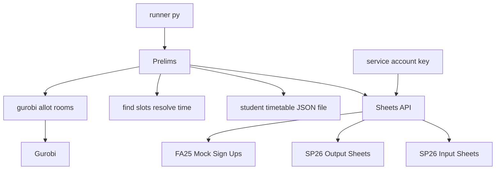
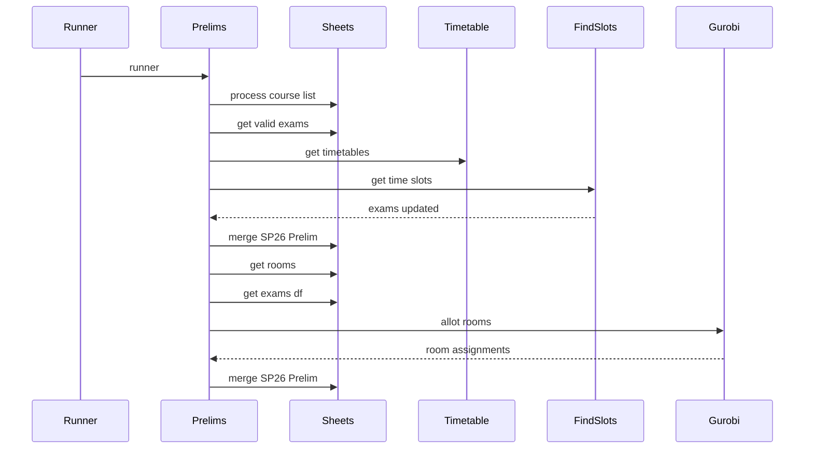

# SDS-ATP — Architecture and technical documentation

This document complements the step-by-step narrative in [workflow_analysis.md](workflow_analysis.md). It emphasizes components, data flow, modeling choices, external services, and non-obvious engineering decisions.

## Purpose

**SDS-ATP** is a two-phase system for accommodated prelim scheduling:

1. **Phase 1 — Time:** Assign *when* each exam runs, respecting student timetables, instructor-approved conflict options, and time-related tags (e.g. NOAM/NOPM).
2. **Phase 2 — Rooms:** Assign *where* each exam runs using a **Gurobi mixed-integer linear program (MILP)** over room *slots* (rows in room availability), with capacity, course-mix, tag, buffer, and inter-exam spacing rules.

There are **no LLM agents or prompts**; behavior is fully deterministic (Python + Google Sheets + Gurobi).

---

## Components

| Layer | Location | Responsibility |
|-------|----------|----------------|
| Entry | `runner.py` | Constructs `Prelims` and calls `runner()`. |
| Orchestration | `service/prelims.py` (`Prelims`) | Sheet I/O, AIM vs internal reconciliation, calls `resolve_time`, builds room/exam frames, invokes `allot_rooms`, writes CSVs and merged Sheet updates. |
| Phase 1 | `utils/find_slots.py` (`resolve_time`) | Sequential per-exam slot search: original time first, then fixed alternative rules from course preferences. |
| Phase 2 | `utils/gurobi_solver.py` (`allot_rooms`) | Builds and solves the MILP; updates `Room No` and `Internal Status`. |
| Integrations | `utils/access_google_sheets.py` | Service-account auth; read sheet as `DataFrame`; full replace or merge-by-primary-key then rewrite. |
| Local input | `timetables/student_timetable.json` | Per-student weekly class intervals for conflict detection. |
| Tests | `test/test_resolve_slots.py` | Builders and expectations for `resolve_time()`. |

---

## System context

GitHub’s Mermaid renderer often breaks on **undirected links** (`---`), **newlines** inside node text, **quoted `subgraph` titles** with special characters, and sometimes **edges between subgraphs**. This version uses a **flat** flowchart: only `-->` and single-line `[labels]`.

Plain-text fallback (same relationships): `runner.py` → `Prelims` → reads or writes Google Sheets via gspread; `Prelims` reads `timetables/student_timetable.json`, calls `resolve_time` and `allot_rooms`; service-account JSON authenticates Sheets; `allot_rooms` calls Gurobi.

---

## End-to-end data flow

---

## Phase 1 model: `resolve_time`

- **Paradigm:** Greedy **row-order** assignment per exam; for each student, a `scheduled` list prevents overlapping exams after each booking.
- **Why not a global MILP for time:** Instructor options are a **small discrete ladder** (same day / before / after / week-after). A sequential rule set matches staff expectations and keeps the formulation explainable; global cross-student fairness would require extra objectives and more AIM-side data contracts.

**Non-obvious rule:** `slot_is_free_aware` allows an exam during the student’s **own** class for that CRN (with an end-time guard for extended time), while alternatives use stricter “no class overlap” checks (`slot_is_valid_alternative`).

---

## Phase 2 model: `allot_rooms` (current)

### Concurrent exam-groups

Within each **room slot** `j` (one row in room availability: date + room window + capacity), exams are partitioned into **concurrent groups** keyed by **exact** `Time_Start` (minutes). Capacity, “max 3 courses,” RD cap, and PRIV isolation apply **per group**, not necessarily across the whole physical window. That allows multiple staggered sessions in the same booked window when **inter-exam gaps** satisfy C7.

### Decision variables (high level)

| Symbol | Role |
|--------|------|
| `x[i,j]` | Exam `i` assigned to room slot `j`. |
| `y[j]` | Room slot `j` is used. |
| `z_g[c,j,ts]` | Course `c` appears in slot `j` in the concurrent group with start time `ts`. |
| `rd_flag_g[j,ts]` | RD present in group `(j,ts)` (drives 20-student cap for that group when room cap > 20). |
| `q[i1,i2,j]` | Both exams assigned to `j` with **15–29 minute** gap between non-concurrent windows (penalized toward 30+ minutes). |

### Compatibility (pre-room window)

Exam `i` is compatible with slot `j` only if: same `Date`, exam interval inside `[room.Time_Start, room.Time_End]`, and **≥ 15 minutes** between room open and exam start (using `_hhmm_to_minutes`). This enforces the hard pre-buffer without extra constraints on every pair.

### Objective hierarchy (`setObjectiveN`, minimize)

| Priority | Name | Intent |
|----------|------|--------|
| P5 | `max_assign` | Maximize assignments (−Σx). |
| P4 | `min_rooms` | Minimize room slots used (Σy). |
| P3 | `min_rooms_per_course` | Minimize Σz_g — **concentrate each course** into fewer (room, start-time) groups. |
| P2 | `prefer_30_buffer` | Prefer **30+ min** room pre-open vs 15–29; plus penalize **15–29 min inter-exam gaps** in the same slot (via Σq). |
| P1 | `prefer_15_post` | Prefer **≥ 15 min** after exam end before room close. |
| P0 | `prefer_zone1` | Prefer Zone 1 over Zone 2. |

### Constraints (summary)

- **C1:** At most one room slot per exam.
- **C2:** Per `(j, ts)` concurrent group, Σx ≤ testing capacity.
- **C3:** At most **3 distinct courses** per `(j, ts)` group (via `z_g` linking).
- **C4:** If any RD in `(j, ts)` and physical cap > 20, that group’s headcount ≤ 20.
- **C5:** PRIV/CODS: no other exam in the **same** `(j, ts)` group (solitary concurrent group, not necessarily emptying the entire slot for other start times).
- **C6:** (Reserved in docstring ordering for room pre-buffer; enforced in compatibility + P2.)
- **C7:** Non-concurrent exams in the same slot: a gap **under 15 minutes** forbids both (`x[i1,j] + x[i2,j] ≤ 1`); a gap from **15 to 29 minutes** is allowed but drives `q` into the P2 objective to prefer **30+** minutes.

**Design note:** Earlier versions modeled **shared capacity across overlapping sheet rows** for the same physical room. The current design instead uses **explicit inter-exam spacing** within a slot row plus **per-group** capacity, which matches “one proctor block” semantics when multiple staggered exams share a long room booking.

---

## External services and credentials

| Service | Role |
|---------|------|
| **Google Sheets** | Source of truth for courses, AIM roster, room master (LIV25), slot-level availability, and SP26 Prelim output. |
| **Gurobi** | MILP solve for `allot_rooms`. |

Auth: `gspread` + `oauth2client` service account JSON (default path in `_get_client()` in `utils/access_google_sheets.py`).

**Sheet writes:** `update_sheet_with_df_with_columns` merges on `Exam_ID`, then clears and rewrites the worksheet — simple and consistent, but heavy for very large tabs (API quota).

---

## Dependencies (from imports)

| Dependency | Use |
|------------|-----|
| pandas | DataFrames for Sheets and solvers. |
| gspread | Spreadsheet API. |
| oauth2client | Service account credentials. |
| gurobipy | MILP. |
| stdlib (`json`, `datetime`, `itertools`) | Timetables, dates, gap pairs. |

Pin versions in a project `requirements.txt` when you add one (not currently in tree).

---

## Operational footguns

- **`process_course_list`** writes a copy to **FA25 NEW MOCK / Sign Ups** while primary data is **SP26** — confirm environment before production runs.
- **Unresolved time slots** still leave `Internal Status` as `"Slot to be booked"` in `find_slots.py` when no alternative is found; some tests expect a distinct `"Unresolved - no available slot"` string (see workflow doc “Known Bug”).

---

## Quick file index

| Path | Role |
|------|------|
| `runner.py` | CLI-style entry. |
| `service/prelims.py` | Pipeline orchestration. |
| `utils/find_slots.py` | Phase 1 scheduling. |
| `utils/gurobi_solver.py` | Phase 2 MILP. |
| `utils/access_google_sheets.py` | Sheets I/O. |
| `docs/workflow_analysis.md` | Detailed pipeline + edge cases. |
